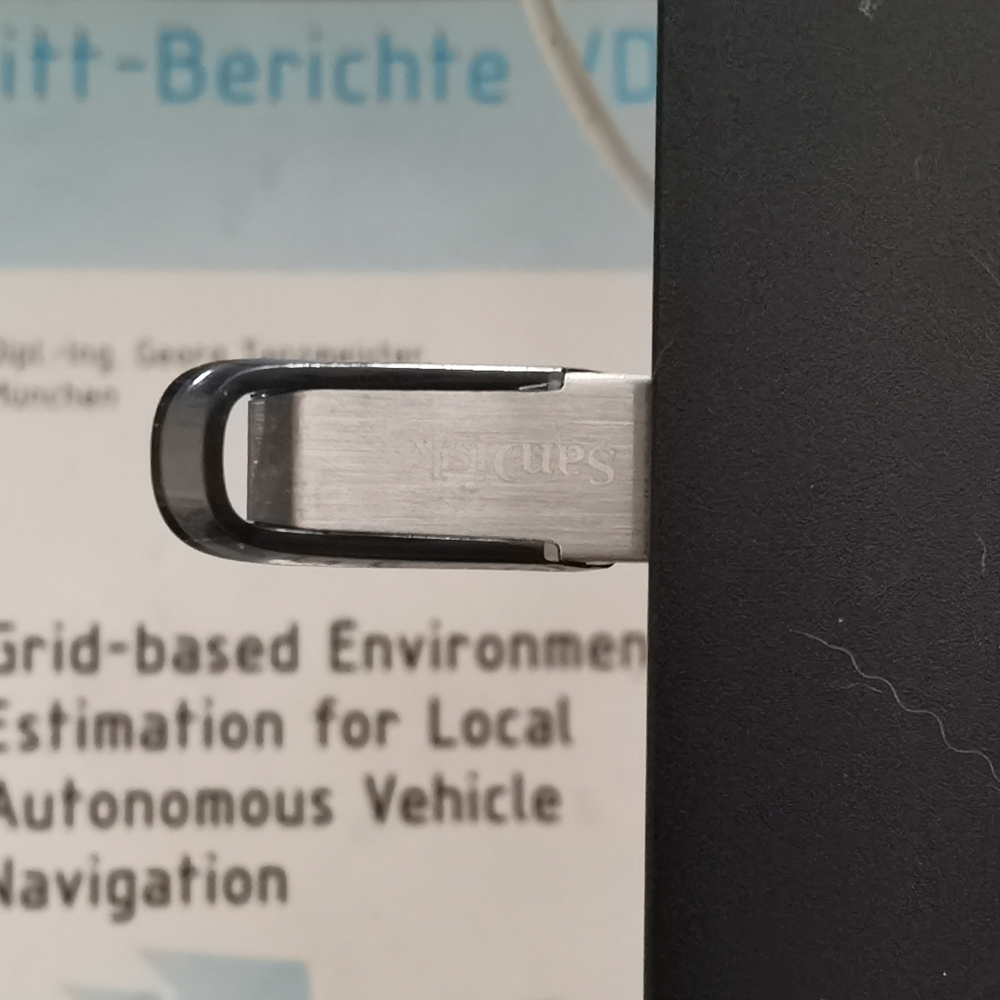
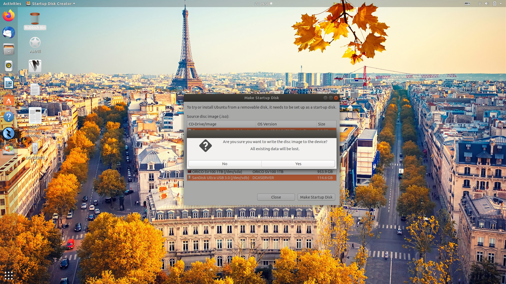

# Ubuntu Setup Guide

如何在外接SSD/NVME上安装Ubuntu系统

---

## Contents

* [基础准备工作](https://www.shenlanxueyuan.com/my/course/303)

* [重新启动并配置BIOS](https://www.shenlanxueyuan.com/my/course/303)

* [安装Ubuntu, Part 1](https://www.shenlanxueyuan.com/my/course/303)

* [安装Ubuntu, 配置分区表](https://www.shenlanxueyuan.com/my/course/303)

* [安装Ubuntu, Part 2](https://www.shenlanxueyuan.com/my/course/303)

* [配置阿里云源](https://www.shenlanxueyuan.com/my/course/303)

---

## 基础准备工作

首先, 准备两个硬盘:

* 一个为**小容量USB Disk**, 用于制作Ubuntu Startup Disk, 作为**Ubuntu Installer**, 记录设备名称, 此处为**SanDisk USB**

    

* 一个为**大容量SSD/NVMe Disk**, 用于Ubuntu Workspace Disk, 作为**Ubuntu Workspace**, 此处为**SAMSUNG SSD T3**

    

接着, 将两个硬盘, 全部**格式化**. 格式化时目标文件系统为**Linux EXT4**. 此处以Ubuntu平台为示例, Windows与Mac用户请自行百度, 两系统均存在类似工具.


最后, 使用工具, 在**小容量USB Disk**上制作**Ubuntu Installer**. 此处以Ubuntu平台为示例, Windows与Mac用户请自行百度, 两系统均存在类似工具.

# **WARNING** 请务必仔细检查**设备名称**!!!确保选择了**正确的目标设备**!!!否则有可能**抹去现有系统盘上的数据**

* 启动Creator:

    

* 选择设备:

        

* 确认制作:

    

---

## 重新启动, 配置BIOS

在Ubuntu Installer制作完成后, 将上述两USB Disk全部连接PC, 然后重新启动PC. 在系统上电时, 进入BIOS. **进入BIOS的方式和使用设备高度相关, 此处仅作示意**

此处目标设备为ThinkPad P73. 在出现OEM Logo时, 按下提示键, 进入BIOS:


选择**Boot Config**:


将启动优先级调整为**USB Device First**. 调整结束后:


* 首选的启动媒介为外接USB
* USB设备名称有2个:

    * 其中一个为**Ubuntu Installer, SanDisk USB**, 它有Bootloader, 能够引导PC进入Ubuntu系统
    * 另一个为**Ubuntu Workspace, SAMSUNG SSD T3**, 它没有Bootloader, 不会引导PC进入Ubuntu系统

* 保存BIOS设置, 重新启动设备, 若配置成功, 应当能看到如下的GRUB界面:


---

## 安装Ubuntu

接下来进入Ubuntu安装

选择语言:


选择键盘Layout:


选择**No Network Connnection**


安装类型选择**Normal Installation & Device Drivers**


硬盘分区选择**Something Else**, 自定义分区类型.


---

## 创建分区表

接下来进入最重要的环节, 创建**Partiton Table**

# **WARNING** 请务必仔细检查**设备名称**!!!确保选择了**正确的目标设备**!!!否则有可能**抹去现有系统盘上的数据**

首先, 选择正确的目标设备, 此处为**Ubuntu Workspace Disk, SAMSUNG SSD T3**, 点击**New Partition Table**


# **WARNING** 请务必仔细检查**设备名称**!!!确保选择了**正确的目标设备**!!!否则有可能**抹去现有系统盘上的数据**

确认:


执行完成后, **Ubuntu Workspace Disk**会全部变成Freespace


接下来**创建分区**. 个人习惯如下, 分区按照**创建先后顺序排列**:

* swap, **New Partition Type**为**Primary**, **Use As**为**swap**, 推荐大小**与PC物理内存相同**.

    

* boot, **New Partition Type**为**Logical**, **Use As**为**EXT4 Filesystem**, 推荐大小**128/256MB**.

    

* root, **New Partition Type**为**Logical**, **Use As**为**EXT4 Filesystem**, 推荐大小为**剩余的全部Free Space**

    

完成后目标设备上的分区表如下图所示, 点击**Install Now**, 启动安装:


---

## 安装Ubuntu

接下来, 完成剩余的配置, 等待安装成功:

选择区域:


设置设备名, 账号/密码:


等待安装结束:


按照提示重启PC, 完成安装.

---

## 配置阿里云源

在设备下电后, 断开**Ubuntu Installer**与PC的链接, 仅保留**Ubuntu Workspace**与PC的链接, 启动Ubuntu.

接下来还需要进行最后一步: **配置阿里云源, 更新系统软件**. 此处**至关重要**, 有些设备只有在获取最新驱动后, 才能够正常使用Ubuntu

首先, 打开**etc-apt-source.list**

```bash
sudo gedit /etc/apt/sources.list
```

删除系统默认配置, 将以下阿里云源配置写入, 保存:

```bash
# See http://help.ubuntu.com/community/UpgradeNotes for how to upgrade to
# newer versions of the distribution.
deb http://mirrors.aliyun.com/ubuntu/ bionic main restricted
# deb-src http://mirrors.aliyun.com/ubuntu/ bionic main restricted

## Major bug fix updates produced after the final release of the
## distribution.
# deb-src http://mirrors.aliyun.com/ubuntu/ bionic-updates main restricted

## N.B. software from this repository is ENTIRELY UNSUPPORTED by the Ubuntu
## team. Also, please note that software in universe WILL NOT receive any
## review or updates from the Ubuntu security team.
deb http://mirrors.aliyun.com/ubuntu/ bionic universe
# deb-src http://mirrors.aliyun.com/ubuntu/ bionic universe
# deb-src http://mirrors.aliyun.com/ubuntu/ bionic-updates universe

## N.B. software from this repository is ENTIRELY UNSUPPORTED by the Ubuntu
## team, and may not be under a free licence. Please satisfy yourself as to
## your rights to use the software. Also, please note that software in
## multiverse WILL NOT receive any review or updates from the Ubuntu
## security team.
deb http://mirrors.aliyun.com/ubuntu/ bionic multiverse
# deb-src http://mirrors.aliyun.com/ubuntu/ bionic multiverse
# deb-src http://mirrors.aliyun.com/ubuntu/ bionic-updates multiverse

## N.B. software from this repository may not have been tested as
## extensively as that contained in the main release, although it includes
## newer versions of some applications which may provide useful features.
## Also, please note that software in backports WILL NOT receive any review
## or updates from the Ubuntu security team.
deb http://mirrors.aliyun.com/ubuntu/ bionic-backports main restricted universe multiverse
# deb-src http://mirrors.aliyun.com/ubuntu/ bionic-backports main restricted universe multiverse

## Uncomment the following two lines to add software from Canonical's
## 'partner' repository.
## This software is not part of Ubuntu, but is offered by Canonical and the
## respective vendors as a service to Ubuntu users.
# deb http://archive.canonical.com/ubuntu bionic partner
# deb-src http://archive.canonical.com/ubuntu bionic partner

deb http://mirrors.aliyun.com/ubuntu/ bionic-security main restricted
# deb-src http://mirrors.aliyun.com/ubuntu/ bionic-security main restricted
deb http://mirrors.aliyun.com/ubuntu/ bionic-security universe
# deb-src http://mirrors.aliyun.com/ubuntu/ bionic-security universe
deb http://mirrors.aliyun.com/ubuntu/ bionic-security multiverse
# deb-src http://mirrors.aliyun.com/ubuntu/ bionic-security multiverse
deb http://mirrors.aliyun.com/ubuntu/ bionic-updates multiverse restricted universe main
```

然后执行系统更新:

```bash
sudo apt-get update && sudo apt-get update
```

配置成功后, 可以看到Packge URL均为阿里云源. 该设置能大幅提升相关依赖安装速度.