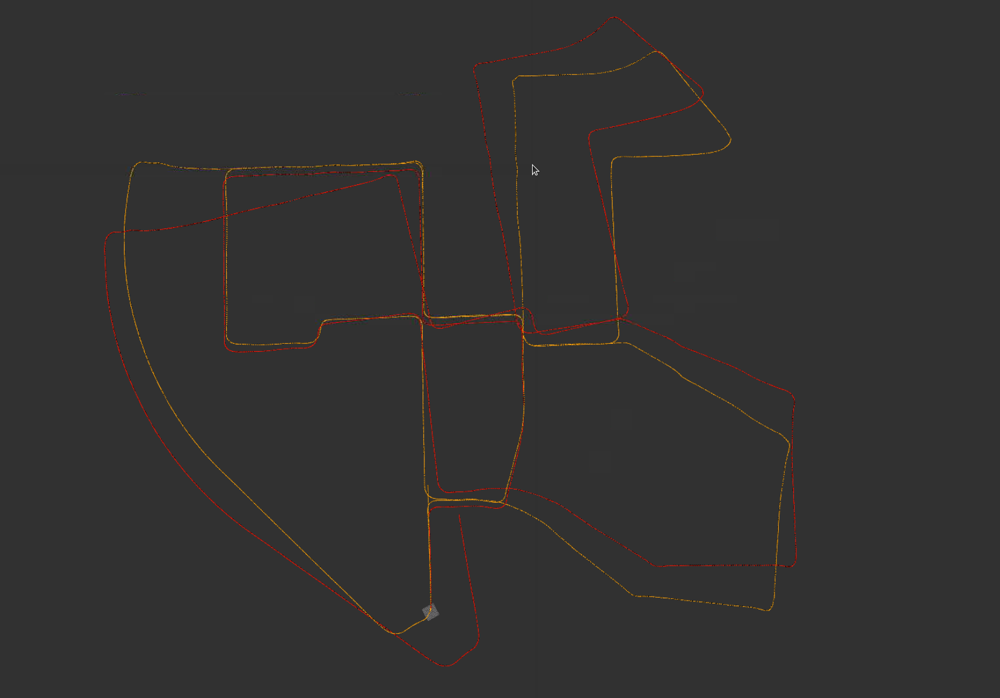
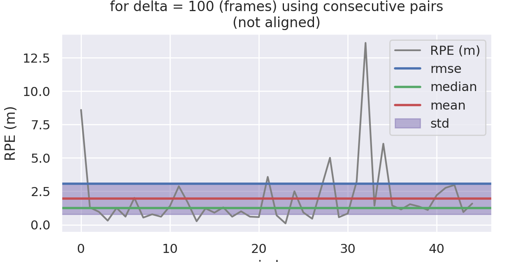
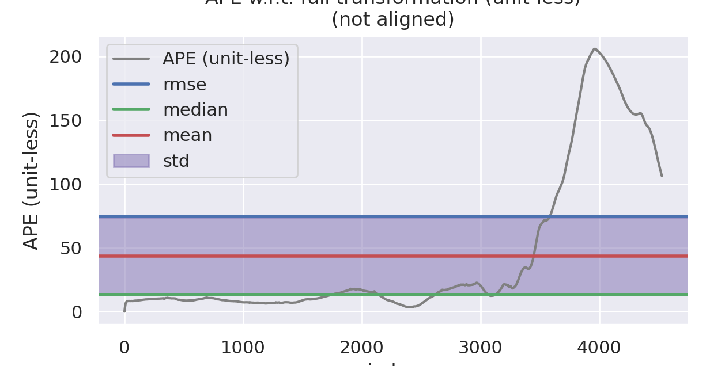
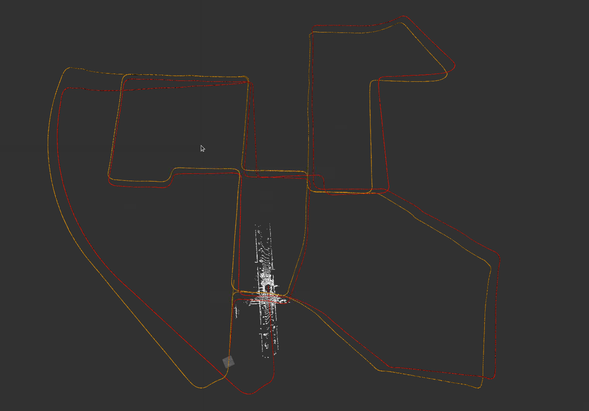
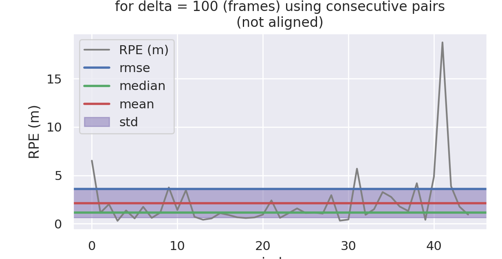

# 第三章作业

## 第一题，残差模型推导

### 线残差

$$
d_\epsilon=\frac{|(\tilde{p_i}-p_a)\times(\tilde{p_i}-p_b)|}{|p_a-p_b|}
$$

$$
\frac{\partial d\epsilon}{\partial T}=\frac{\partial d\epsilon}{\partial \tilde{p_i}}\frac{\partial \tilde{p_i}}{\partial T}
$$

记
$$
X=(\tilde{p_i}-p_a)\times(\tilde{p_i}-p_b)
$$


则
$$
\frac{\partial d\epsilon}{\partial \tilde{p_i}}=\frac{1}{|p_a-p_b|}\frac{X}{|X|}(\frac{\partial (\tilde{p_i}-p_a)^{\bigwedge}(\tilde{p_i}-p_b)}{\partial(\tilde{p_i}-p_b)}+\frac{ (\tilde{p_i}-p_a)^{\bigwedge}\partial(\tilde{p_i}-p_b)}{\partial(\tilde{p_i}-p_a)})=\frac{1}{|p_a-p_b|}\frac{X}{|X|}(-(\tilde{p_i}-p_b)^{\bigwedge}+(\tilde{p_i}-p_a)^{\bigwedge}) = \frac{X}{|X|}\frac{(p_b-p_a)^{\bigwedge}}{|p_a-p_b|}
$$


根据李代数的性质
$$
\frac{\partial \tilde{p_i}}{\partial T}= \begin{bmatrix}I & -(Rp_i+t)^{\bigwedge}\\ 0 & 0\end{bmatrix}
$$

### 面残差

$$
d_H=(\tilde{p_i}-p_j) \bullet \frac{(p_l-p_j)\times(p_m-p_j)}{|(p_l-p_j)\times (p_m-p_j)|}
$$

$$
\frac{\partial d_H}{\partial T}=\frac{\partial d_H}{\partial \tilde{p_i}}\frac{\partial \tilde{p_i}}{\partial T}
$$

其中
$$
\frac{\partial d_H}{\partial \tilde{p_I}} = \frac{(p_l-p_j)\times(p_m-p_j)}{|(p_l-p_j)\times (p_m-p_j)|}
$$


右边第二项与线残差的公式相同，不继续推导

## 第二题，雅各比矩阵ceres解析求导的实现

此处参考了网上的代码，实现了基于sophus的SE3李代数形式的求导


```cpp
class SophusLidarEdgeFactor : public ceres::SizedCostFunction<1, 6> {
public:
    SophusLidarEdgeFactor(
        Eigen::Vector3d& cur_point, 
        Eigen::Vector3d& last_point_a, 
        Eigen::Vector3d& last_point_b) : 
            cur_point_(cur_point), 
    		last_point_a_(last_point_a), 
    		last_point_b_(last_point_b) {}
    
    virtual ~SophusLidarEdgeFactor() {}

    virtual bool Evaluate(double const * const * parameters, 
                          double *residuals, double **jacobians) const {
        Eigen::Map<const Eigen::Matrix<double, 6, 1>> lie(parameters[0]);
        Sophus::SE3d T = Sophus::SE3d::exp(lie);

        Eigen::Vector3d lp = T * cur_point_;
        Eigen::Vector3d de = last_point_a_ - last_point_b_;
        Eigen::Vector3d nu = (lp - last_point_b_).cross(lp - last_point_a_);
        residuals[0] = nu.norm() / de.norm();

        if (jacobians != nullptr) {
            if (jacobians[0] != nullptr) {
                Eigen::Matrix3d lp_hat = Sophus::SO3d::hat(lp);
                Eigen::Matrix<double, 3, 6> dp_dse3;
                (dp_dse3.block<3, 3>(0, 0)).setIdentity();
                dp_dse3.block<3, 3>(0, 3) = -lp_hat;

                Eigen::Map<Eigen::Matrix<double, 1, 6>> J_se3(jacobians[0]);
                J_se3.setZero();
                
                Eigen::Matrix<double, 1, 3> de_dp = 
                    (nu / (de.norm() * nu.norm())).transpose() * Sophus::SO3d::hat(de);
                J_se3.block<1, 6>(0, 0) = de_dp * dp_dse3;
            }
        }
        return true;
    }

    Eigen::Vector3d cur_point_;
    Eigen::Vector3d last_point_a_;
    Eigen::Vector3d last_point_b_;
};

class SophusLidarPlaneFactor : public ceres::SizedCostFunction<1, 6> {
public:
    SophusLidarPlaneFactor(
        Eigen::Vector3d curr_point, 
        Eigen::Vector3d last_point_j,
        Eigen::Vector3d last_point_l, 
        Eigen::Vector3d last_point_m) : 
        curr_point_(curr_point), 
        last_point_j_(last_point_j), 
        last_point_l_(last_point_l), 
        last_point_m_(last_point_m) { }

    virtual ~SophusLidarPlaneFactor() {}
    
    virtual bool Evaluate(double const *const *parameters, 
                          double *residuals, 
                          double **jacobians) const {
        Eigen::Map<const Eigen::Matrix<double, 6, 1>> lie(parameters[0]);
        Sophus::SE3d T = Sophus::SE3d::exp(lie);
        Eigen::Vector3d lpi = T * curr_point_;
        Eigen::Vector3d pipj = lpi - last_point_j_;
        Eigen::Vector3d ljm_norm = 
            (last_point_l_ - last_point_j_).cross(last_point_m_ - last_point_j_);
        ljm_norm.normalize();

        residuals[0] = pipj.dot(ljm_norm);
        if (jacobians != nullptr) {
            if (jacobians[0] != nullptr) {
                Eigen::Matrix3d lp_hat = Sophus::SO3d::hat(lpi);
                Eigen::Matrix<double, 3, 6> dp_dse3;
                (dp_dse3.block<3, 3>(0, 0)).setIdentity();
                dp_dse3.block<3, 3>(0, 3) = -lp_hat;

                Eigen::Matrix<double, 1, 6> J = ljm_norm.transpose() * dp_dse3;
                jacobians[0][0] = J(0);
                jacobians[0][1] = J(1);
                jacobians[0][2] = J(2);
                jacobians[0][3] = J(3);
                jacobians[0][4] = J(4);
                jacobians[0][5] = J(5);
            }
        }
        return true;
    }
    Eigen::Vector3d curr_point_, last_point_j_, last_point_l_, last_point_m_;
    
};

class PoseSE3Parameterization : public ceres::LocalParameterization {
public:
    PoseSE3Parameterization() {}

    virtual ~PoseSE3Parameterization() {}

    virtual bool Plus(const double *x, 
                      const double *delta, 
                      double *x_plus_delta) const {
        Eigen::Map<const Eigen::Matrix<double, 6, 1>> lie(x);
        Eigen::Map<const Eigen::Matrix<double, 6, 1>> delta_lie(delta);

        Sophus::SE3d T = Sophus::SE3d::exp(lie);
        Sophus::SE3d delta_T = Sophus::SE3d::exp(delta_lie);
        Eigen::Matrix<double, 6, 1> x_plus_delta_lie = (delta_T * T).log();
        
        for (size_t i = 0; i < 6; i++) {
            x_plus_delta[i] = x_plus_delta_lie(i, 0);
        }
        return true;
    }

    virtual bool ComputeJacobian(const double *x, double *jacobian) const {
        ceres::MatrixRef(jacobian, 6, 6) = ceres::Matrix::Identity(6, 6);
        return true;
    }

    virtual int GlobalSize() const {return Sophus::SE3d::DoF;}
    virtual int LocalSize() const {return Sophus::SE3d::DoF;}
};
```

## 第三题，结果验证及评估

为了深刻的理解ALOAM的思想及代码实现细节，将ALOAM作为一个前端匹配器集成到了代码框架中，完全匹配了前端的接口，可以在配置文件中实现切换，并且为了更加直观将基于四元数的位姿表示更改为基于SE3的姿态表示，同时加入了点云去畸变的代码。但是，为了匹配代码框架中的实现流程及前帧点云更新方式，对ALOAM的代码细，包括匹配方式，同时为了避免重复计算，简化了与地图匹配的过程，适配了代码框架的局部地图作了一定修改，导致在没有回环的情况下累积误差偏大，但总体实现是没有问题的。

### 自动求导结果







### 解析求导结果






从图中结果可以看出，缺乏回环矫正的情况下在拐弯的情况下由于实现流程和缺乏回环导致误差会偏大，解析求求导和自动求导的结果相似。总体来看轨迹的趋势还是正确的，算法应该没有问题，但是参数调整还有改进的余地
