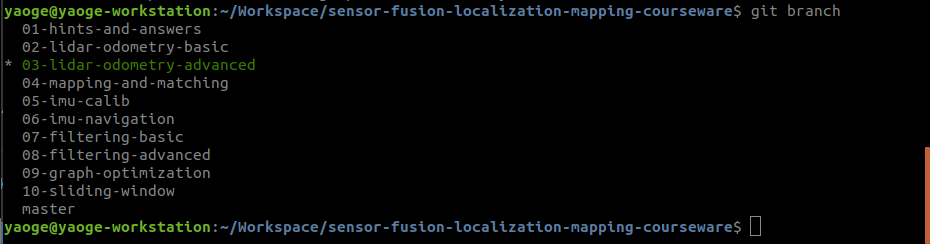
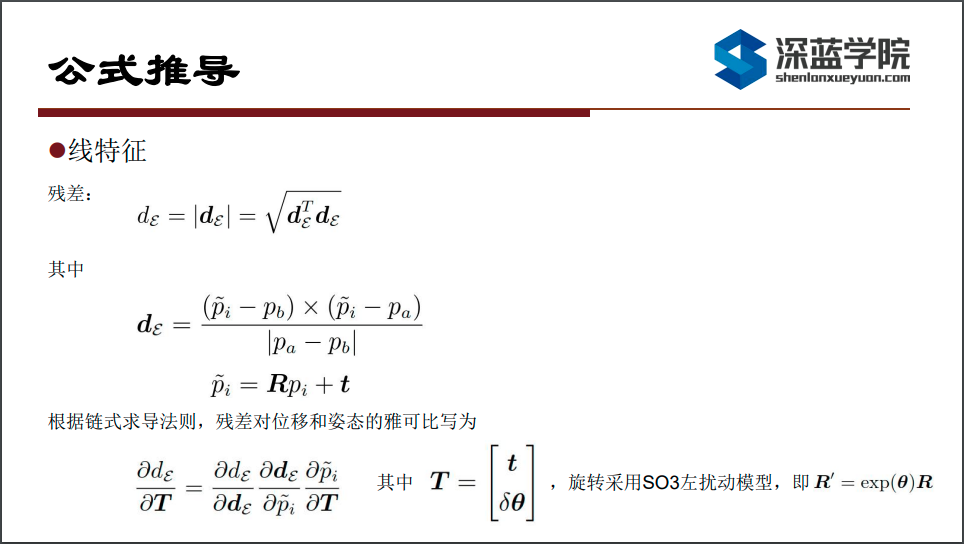
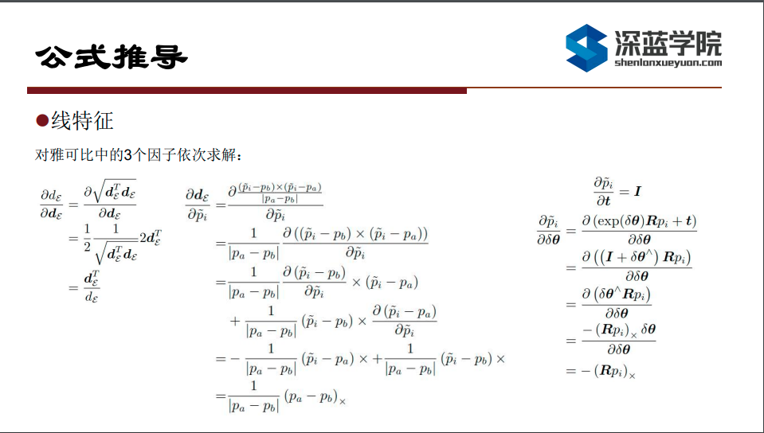
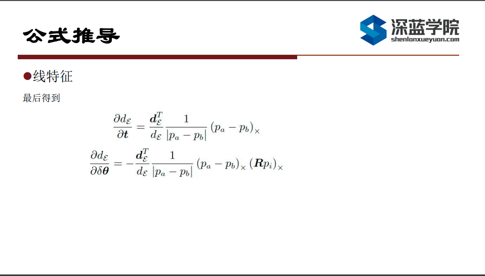
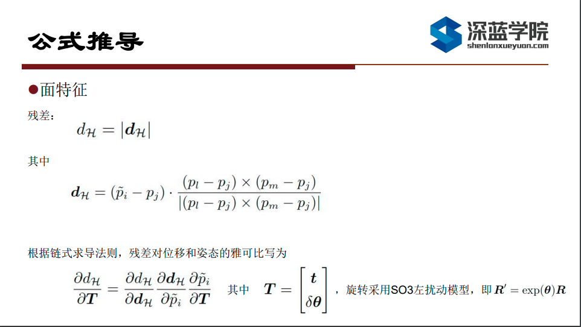
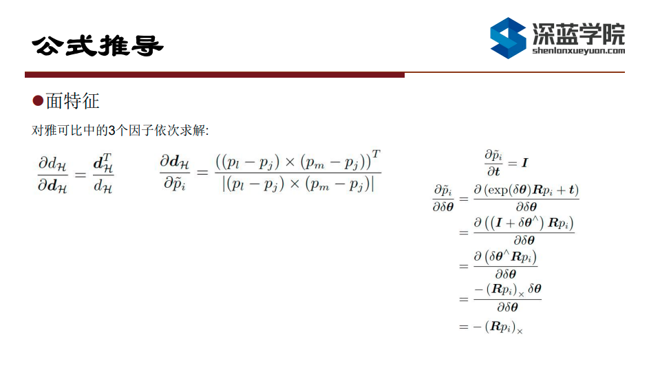
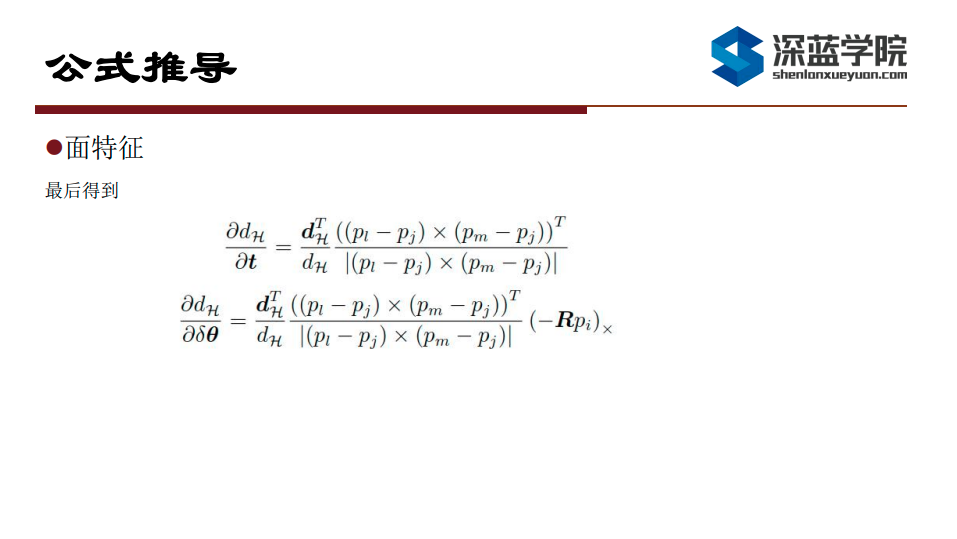
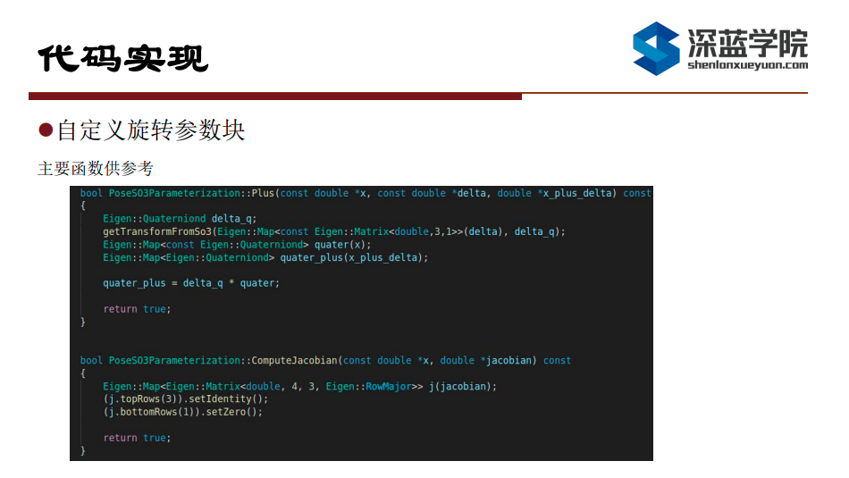
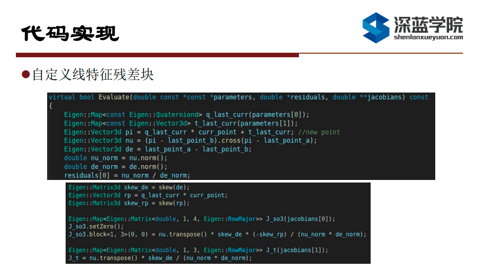
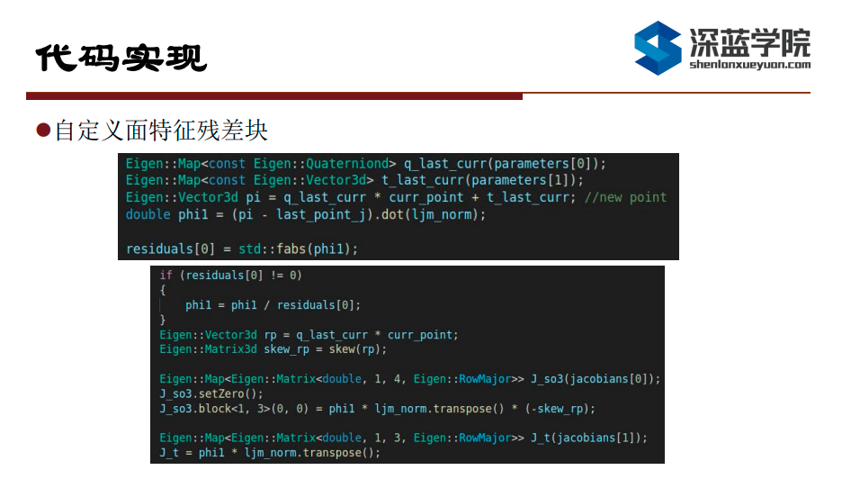

# Multi-Sensor Fusion for Localization & Mapping: 多传感器融合定位与建图: Lidar Odometry Advanced

深蓝学院, 多传感器融合定位与建图, 第3章Lidar Odometry Advanced代码框架.

---

## Overview

本作业旨在实现基于线面特征的激光前端里程计算法.

---

## Getting Started

### 环境检查: 确保Git Repo与使用的Docker Image均为最新

首先, 请确保选择了正确的branch **03-lidar-odometry-advanced**:



执行以下命令，确保所使用的Git Repo与Docker Image均为最新:

```bash
# update git repo:
git pull
#
# update docker image:
#
# 1. first, login to Sensor Fusion registry -- default password is shenlansf20210122:
docker login --username=937570601@qq.com registry.cn-shanghai.aliyuncs.com
# 2. then download images:
docker pull registry.cn-shanghai.aliyuncs.com/shenlanxueyuan/sensor-fusion-workspace:bionic-cpu-vnc
```

### 及格要求: 推导残差模型的雅可比

#### 线特征







#### 面特征







### 良好要求: 编程实现新模型的解析式求导

在理解Ceres API的基础上, 按照Q1的推导实现即可.

#### Solution Overview

1. 图优化中的顶点, 是被优化的变量. Ceres中被定义为ParameterBlock(参数块).
2. 图优化中的边, 是观测对变量的约束. Ceres中被定义为ResidualBlock(残差块).
3. 旋转或者位姿参数块的自定义方法, 可参考FLOAM中的PoseSE3Parameterization类, 主要实现以下两个函数:
   1. Plus
   2. ComputeJacobian
4. 残差块的自定义方法可参考FLOAM中的EdgeAnalyticCostFunction, 主要实现Evaluate函数.
5. 残差块关于LocalParameterization参数块的雅可比为dr/dx_local, 在Ceres中分为两部分dr/dx_global * dx_global/dx_local, 其中:
   1. dr/dx_global定义在残差块Evaluate函数中
   2. dx_global/dx_local定义在参数块ComputeJacobian函数中

#### Solution Sketch







### 优秀要求: 给出新模型基于evo的精度评测结果

相信你可以搞定!

