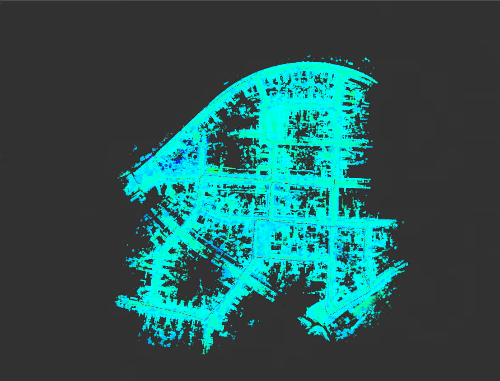
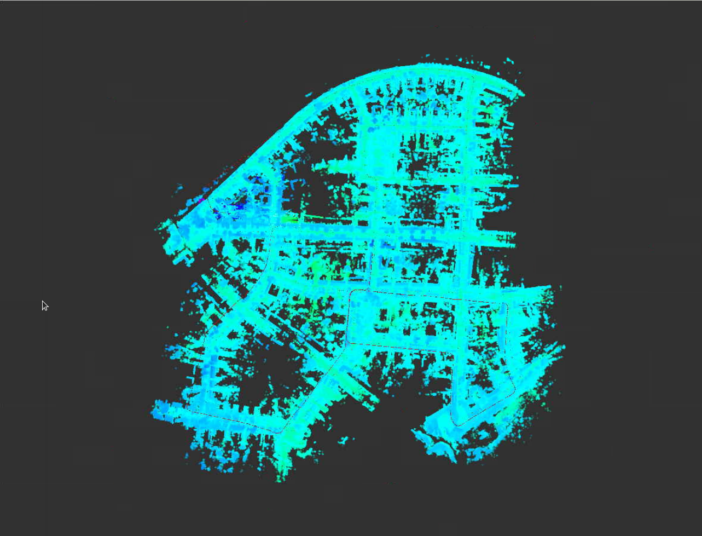
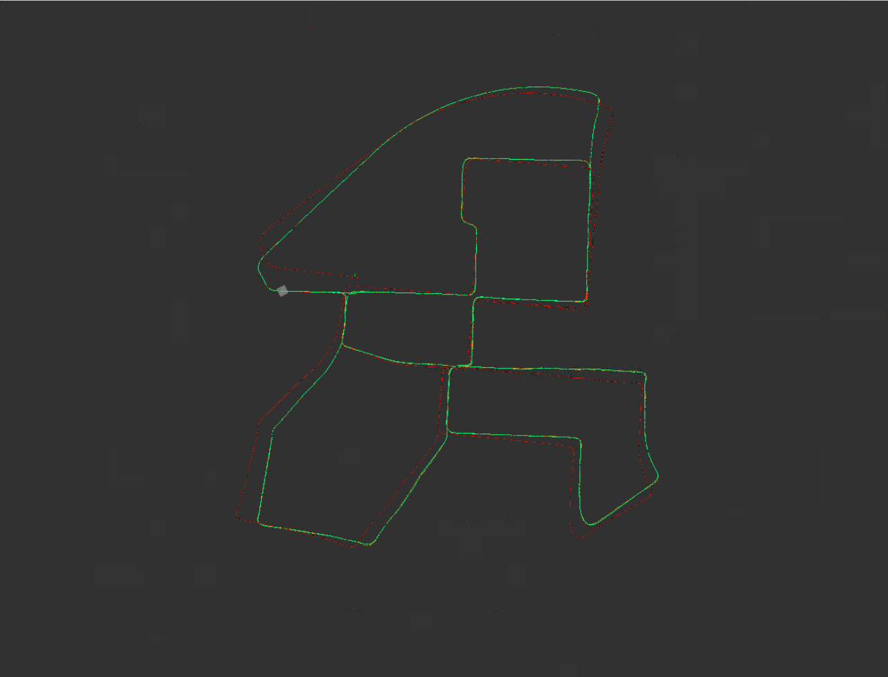
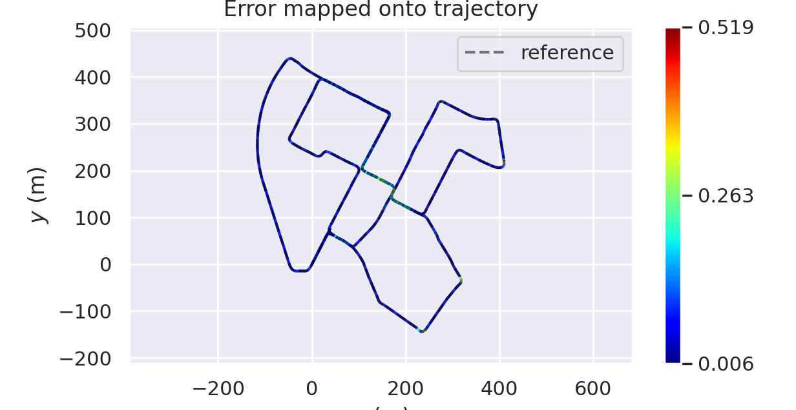
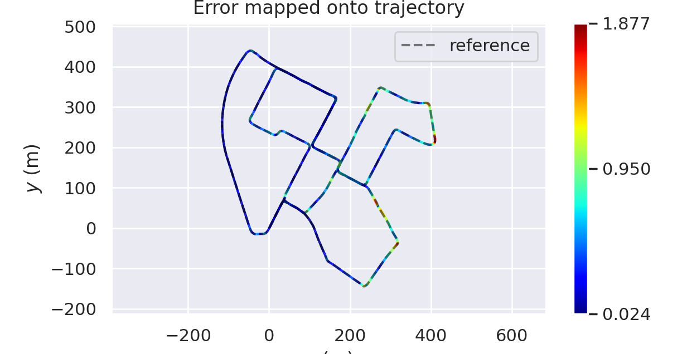
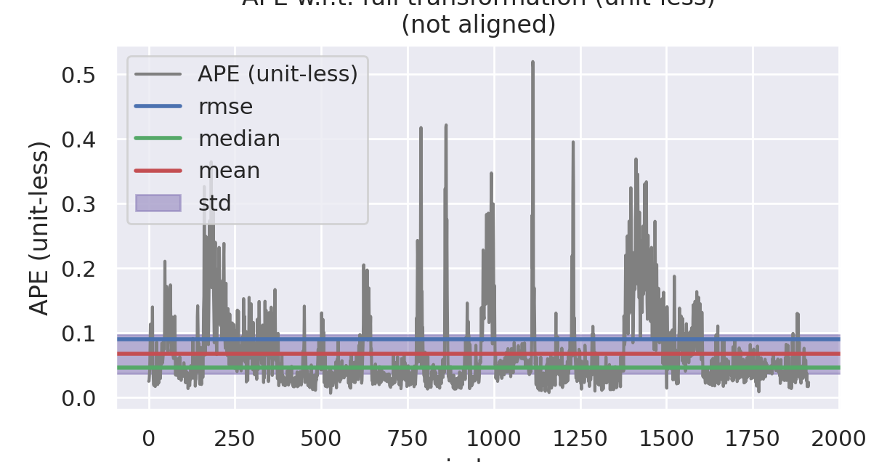
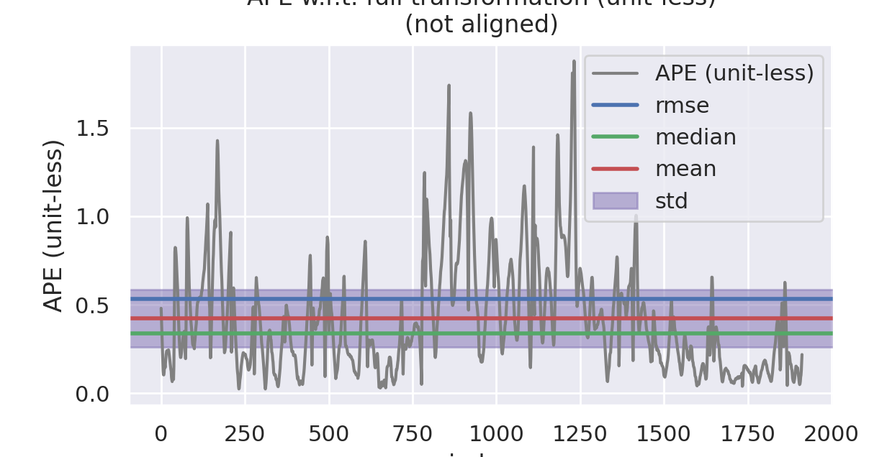

# 第九章作业

## 补全预积分的相关公式

预积分的残差如下:
$$
\begin{bmatrix} r_p \\ r_q \\ r_v \\ r_{ba} \\ r_{bg} \end{bmatrix} = \begin{bmatrix}
q_{wb_i}^{*}(p_{wb_j} - p_{wb_i} - v_i^w \Delta t + \frac{1}{2}g^w \Delta t^2) - \alpha_{b_i b_j} \\
2[q_{b_i b_j}^{*} \bigotimes (q_{wb_i}^{*} \bigotimes q_{w b_j})]_{xyz} \\
q_{w b_i}^{*}(v_j^w - v_i^w + g^w \Delta t) - \beta_{b_i b_j} \\
b_j^a - b_i^a \\
b_j^g - b_i^g
\end{bmatrix}
$$
接下来写出预积分残差对于各个变量的雅各比

### 姿态残差的雅各比

1. 对i时刻姿态的雅各比
   $$
   \frac{\partial r_q }{\partial \delta \theta_{b_i b_i^{'}}} = -2 \begin{bmatrix} 0 & I \end{bmatrix} [q_{w b_j}^{*} \bigotimes q_{w b_I}]_{L}[q_{b_i b_j}]_{R} \begin{bmatrix} 0 \\ \frac{1}{2}I \end{bmatrix}
   $$
   
2. 对j时刻姿态的雅各比
   $$
   \frac{\partial r_q }{\partial \delta \theta_{b_j b_j^{'}}} = -2 \begin{bmatrix} 0 & I \end{bmatrix} [q_{w b_j}^{*} \bigotimes q_{w b_I}]_{L}[q_{b_i b_j}]_{R} \begin{bmatrix} 0 \\ \frac{1}{2}I \end{bmatrix}
   $$

3. 对i时刻陀螺仪bais偏差的雅各比
   $$
   \frac{\partial r_q}{\partial \delta b_i^g} = -2 \begin{bmatrix} 0 & I \end{bmatrix}[q_{w b_j}^{*} \bigotimes q_{w b_i} \bigotimes q_{b_i b_j}]_L \begin{bmatrix} 0 \\ \frac{1}{2} J_{b_i^g}^q \end{bmatrix}
   $$

### 速度残差的雅各比

1. 对i时刻姿态的雅各比
   $$
   \frac{\partial r_v}{\partial \delta \theta_{b_i b_i^{'}}} = [R_{b_iw}(v_j^w - v_i^w + g^w \Delta t)]_{\times}
   $$
   
2. 对i时刻速度的雅各比
   $$
   \frac{\partial r_v}{\partial \delta v_i^w} = -R_{wb_i}
   $$
   
3. 对j时刻速度的雅各比
   $$
   \frac{\partial r_v}{\partial \delta v_j^w} = R_{wb_i}
   $$
   
4. 对i时刻加速度计bias的雅各比
   $$
   \frac{\partial r_v}{\partial \delta b_i^a} = -\frac{\partial \beta_{b_i b _j}}{\partial \delta b_i^a} = - J_{b_i^a}^{\beta}
   $$

5. 对i时刻陀螺仪bias的雅各比
   $$
   \frac{\partial r_v}{\partial \delta b_i^g} = -\frac{\partial \beta_{b_i b _j}}{\partial \delta b_i^g} = - J_{b_i^g}^{\beta}
   $$

### 位置残差的雅各比

1. 对i时刻姿态的雅各比
   $$
   \frac{\partial r_p}{\partial \delta \theta_{b_i b_i^{'}}} = [R_{b_iw}(p_{wb_j} - p_{wb_i} - v_i^w \Delta t + \frac{1}{2}g^w \Delta t^2)]_{\times}
   $$
   
2. 对i时刻速度的雅各比
   $$
   \frac{\partial r_p}{\partial \delta v_i^w}= -R_{wb_i} \Delta t
   $$
   
3. 对i时刻位置的雅各比
   $$
   \frac{\partial r_p}{\partial \delta p_i^w} = -R_{wb_i}
   $$
   
4. 对j时刻位置的雅各比
   $$
   \frac{\partial r_p}{\partial \delta p_j^w} = R_{wb_i}
   $$
   
5. 对i时刻加速度计bias的雅各比
   $$
   \frac{\partial r_p}{\partial \delta b_i^a} = -\frac{\partial \alpha_{b_i b _j}}{\partial \delta b_i^a} = - J_{b_i^a}^{\alpha}
   $$

6. 对i时刻陀螺仪bias的雅各比
   $$
   \frac{\partial r_p}{\partial \delta b_i^g} = -\frac{\partial \alpha_{b_i b _j}}{\partial \delta b_i^g} = - J_{b_i^g}^{\alpha}
   $$

### 加速度计残差的雅各比

1. 对i时刻加速度计bias的雅各比
   $$
   \frac{\partial r_{ba}}{\partial \delta b_i^a} = -I
   $$
   
2. 对j时刻加速度计bias的雅各比
   $$
   \frac{\partial r_{ba}}{\partial \delta b_j^a} = I
   $$

### 陀螺仪残差的雅各比

1. 对I时刻陀螺仪bias的雅各比
   $$
   \frac{\partial r_{bg}}{\partial \delta b_i^g} = -I
   $$

2. 对j时刻陀螺仪bias的雅各比
   $$
   \frac{\partial r_{bg}}{\partial \delta b_j^g} = I
   $$

## 实现和不加IMU时的效果对比和分析

| 加入预积分约束后                  | 不加预积分约束前                  |
| --------------------------------- | --------------------------------- |
|                |  |
|                |                |
|  |  |
|  |  |

相关误差数据:

**加入IMU预积分约束后**

```bash
APE w.r.t. full transformation (unit-less)
(not aligned)

       max	0.519413
      mean	0.067246
    median	0.046663
       min	0.006491
      rmse	0.089805
       sse	15.428082
       std	0.059522
```

**不加IMU预积分约束前**

```bash
APE w.r.t. full transformation (unit-less)
(not aligned)

       max	1.876983
      mean	0.422984
    median	0.339734
       min	0.023871
      rmse	0.532754
       sse	542.959854
       std	0.323899
```

根据对比结果可以得知，加入`IMU预积分约束后`，对于轨迹的整体精度有了一定改善，同时在一定程度上抑制了轨迹波动

## 完成融合编码器时预积分公式的推导(方差递推、残差对状态量雅可比、bias更新等)

融合编码器时，根据ppt中的描述，测量数据为

1. 陀螺仪的角速度
   $$
   \omega_k = \begin{bmatrix} \omega_{xk} \\ \omega_{yk} \\ \omega_{zk} \end{bmatrix}
   $$

2. 编码器的速度(其实就是ppt中所说的单位时间内的位移增量)
   $$
   v_k = \begin{bmatrix} v_{xk} \\ 0 \\ 0 \end{bmatrix}
   $$

预计分量为
$$
\alpha_{b_i b_j} = \int_{t \in[i,j]}{(q_{b_ib_t} v^{bt})\delta t} \\
q_{b_i b_j} = \int_{t \in[i,j]}{q_{b_i b_t} \bigotimes \begin{bmatrix} 0 \\ \frac{1}{2} \omega^{bt} \end{bmatrix}}
$$
对应的预积分量更新方式为
$$
q_{b_i b_k+1} = q_{b_i b_k} \bigotimes \begin{bmatrix} 1 \\ \frac{1}{2} \omega^{b} \delta t \end{bmatrix}\\
\alpha_{b_i b_k+1} = \alpha_{b_i b_k} + v^{w} \delta t
$$
其中
$$
\omega^{b} = \frac{1}{2}[(\omega^{b_k} - b_i^g) + (\omega^{b_{k+1}} - b_i^g)] \\ 
\phi^{w} = \frac{1}{2}(q_{b_i b_k} \phi^{b_k} +  q_{b_i b_k} \phi^{b_k} )
$$


对应的误差传递方程(此处认为编码器没有误差)为
$$
\delta\theta_{k+1} = [I - [\frac{\omega^{b_k} + \omega^{b_{k+1}}}{2}- b_{\omega k}]_{\times} \delta t ] \delta \theta_k + \frac{\delta t}{2}n_{\omega_k} + \frac{\delta t}{2}n_{\omega_{k+1}} - \delta b_{\omega_k} \delta t \\
\delta \alpha_{k+1} = \delta\alpha_k - (\frac{R_k [v_k]_{\times}}{2} \delta\theta_k + \frac{R_{k+1} [v_{k+1}]_{\times}}{2} \delta\theta_{k+1}) \delta t \\ =\delta \alpha_{k+1} = \delta\alpha_k - (\frac{R_k [v_k]_{\times}}{2} \delta\theta_k + \frac{R_{k+1} [v_{k+1}]_{\times}}{2} ([I - [\frac{\omega^{b_k} + \omega^{b_{k+1}}}{2}- b_{\omega k}]_{\times} \delta t ] \delta \theta_k + \frac{\delta t}{2}n_{\omega_k} + \frac{\delta t}{2}n_{\omega_{k+1}} - \delta b_{\omega_k} \delta t)) \delta t \\ =\delta \alpha_k - (\frac{R_k [v_k]_{\times} + R_{k+1} [v_{k+1}]_{\times} ([I - [\frac{\omega^{b_k} + \omega^{b_{k+1}}}{2}- b_{\omega k}]_{\times} \delta t ])}{2} \delta t) \delta \theta_k + \frac{R_{k+1} [v_{k+1}]_{\times} \delta t^2}{4}\delta b_{w_k} - \frac{R_{k+1} [v_{k+1}]_{\times} \delta t^2}{4}n_{\omega_k} - \frac{R_{k+1} [v_{k+1}]_{\times} \delta t^2}{4}n_{\omega_{k+1}} \\ 
\delta b_{\omega_{k+1}} = \delta b_{\omega_k} +  \delta tn_{b_\omega}
$$
当bias变化时，预积分的更新方式为
$$
\alpha_{b_i b_j} = \alpha_{b_i b_j} + J^{\alpha}_{b_i^g} \delta b_i^g \\ 
q_{b_i b_j} = q_{b_i b_j} \bigotimes \begin{bmatrix} 1 \\ \frac{1}{2} J_{b_i^g}^q \delta b_i^g \end{bmatrix}
$$
预积分残差为
$$
\begin{bmatrix} r_p \\ r_q \\ r_{b_g} \end{bmatrix} = \begin{bmatrix} q_{wb_i}^{*}(p_{wb_j} - p_{wb_i}） - \alpha_{b_i b_j} \\
2[q_{b_i b_j}^{*} \bigotimes (q_{wb_i}^{*} \bigotimes q_{w b_j})]_{xyz} \\ b_j^g - b_i^g\end{bmatrix}
$$

### 姿态残差的雅各比

1. 对i时刻姿态的雅各比
   $$
   \frac{\partial r_q }{\partial \delta \theta_{b_i b_i^{'}}} = -2 \begin{bmatrix} 0 & I \end{bmatrix} [q_{w b_j}^{*} \bigotimes q_{w b_I}]_{L}[q_{b_i b_j}]_{R} \begin{bmatrix} 0 \\ \frac{1}{2}I \end{bmatrix}
   $$

2. 对j时刻姿态的雅各比
   $$
   \frac{\partial r_q }{\partial \delta \theta_{b_j b_j^{'}}} = -2 \begin{bmatrix} 0 & I \end{bmatrix} [q_{w b_j}^{*} \bigotimes q_{w b_I}]_{L}[q_{b_i b_j}]_{R} \begin{bmatrix} 0 \\ \frac{1}{2}I \end{bmatrix}
   $$

3. 对i时刻陀螺仪bais偏差的雅各比
   $$
   \frac{\partial r_q}{\partial \delta b_i^g} = -2 \begin{bmatrix} 0 & I \end{bmatrix}[q_{w b_j}^{*} \bigotimes q_{w b_i} \bigotimes q_{b_i b_j}]_L \begin{bmatrix} 0 \\ \frac{1}{2} J_{b_i^g}^q \end{bmatrix}
   $$

### 位置残差的雅各比

1. 对i时刻姿态的雅各比
   $$
   \frac{\partial r_p}{\partial \delta \theta_{b_i b_i^{'}}} = [R_{b_iw}(p_{wb_j} - p_{wb_i} )]_{\times}
   $$

2. 对i时刻位置的雅各比
   $$
   \frac{\partial r_p}{\partial \delta p_i^w} = -R_{wb_i}
   $$

3. 对j时刻位置的雅各比
   $$
   \frac{\partial r_p}{\partial \delta p_j^w} = R_{wb_i}
   $$
   
4. 对i时刻陀螺仪bias的雅各比
   $$
   \frac{\partial r_p}{\partial \delta b_i^g} = -\frac{\partial \alpha_{b_i b _j}}{\partial \delta b_i^g} = - J_{b_i^g}^{\alpha}
   $$

### 陀螺仪残差的雅各比

1. 对I时刻陀螺仪bias的雅各比
   $$
   \frac{\partial r_{bg}}{\partial \delta b_i^g} = -I
   $$

2. 对j时刻陀螺仪bias的雅各比
   $$
   \frac{\partial r_{bg}}{\partial \delta b_j^g} = I
   $$

