# Multi-Sensor Fusion for Localization & Mapping: Graph Optimization -- 多传感器融合定位与建图: 基于图优化的建图方法

深蓝学院, 多传感器融合定位与建图, 第9章Graph Optimization for Mapping代码框架.

---

## Overview

本作业旨在加深对**基于图优化的建图方法**的理解.

---

## Hints

### 及格要求: 公式推导正确, 补全代码之后功能正常

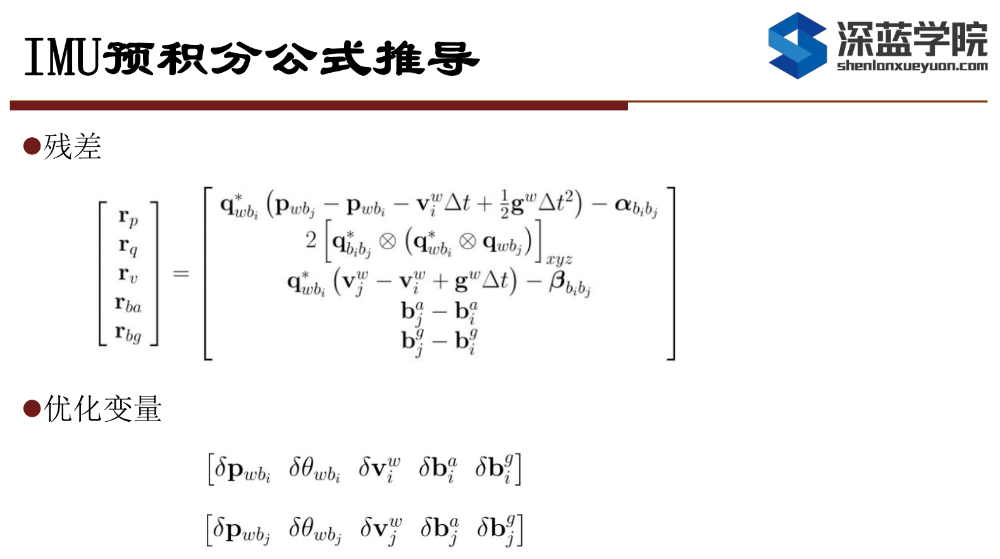

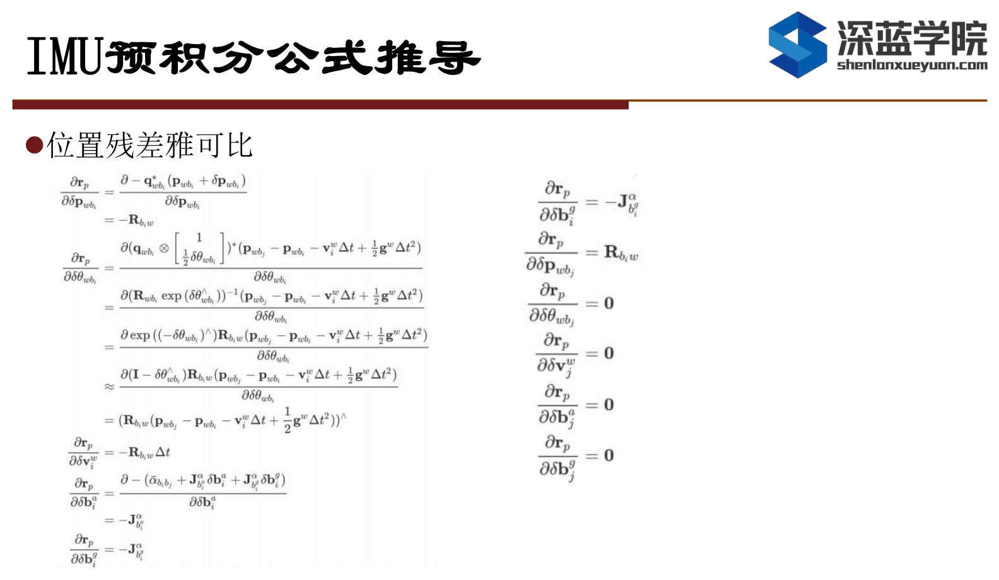

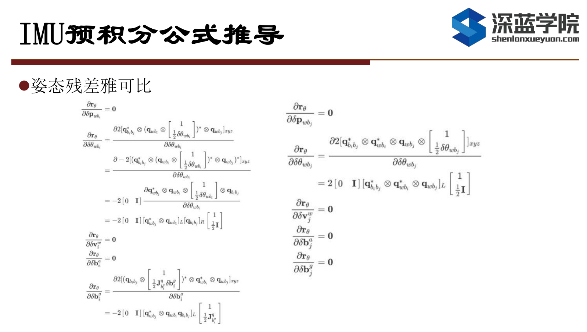

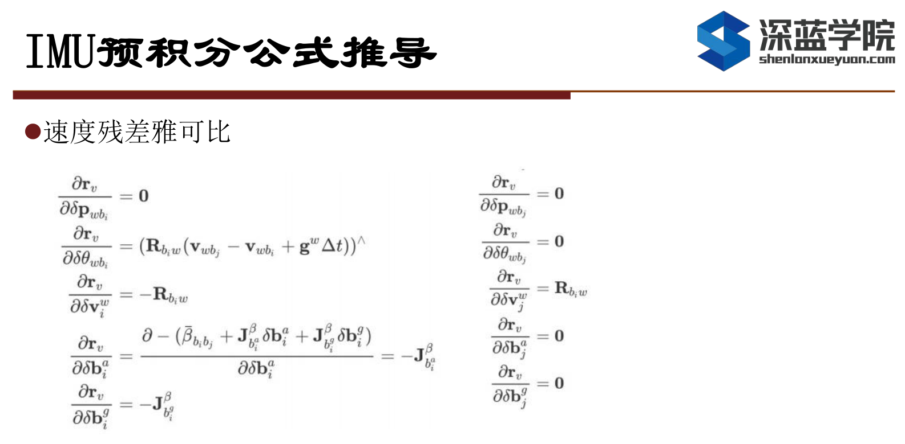

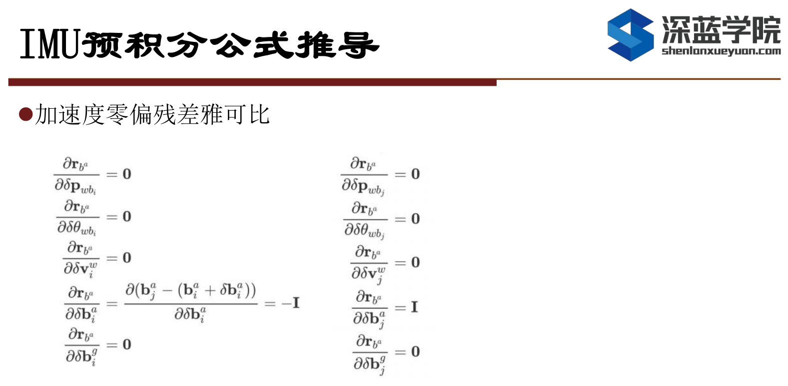

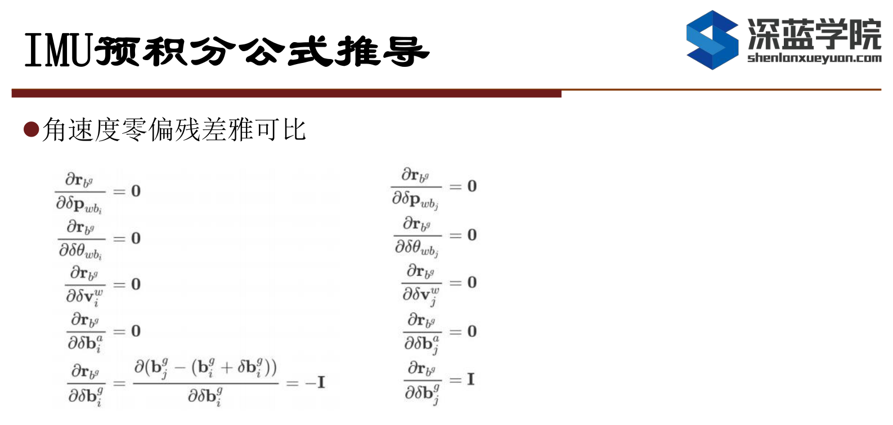

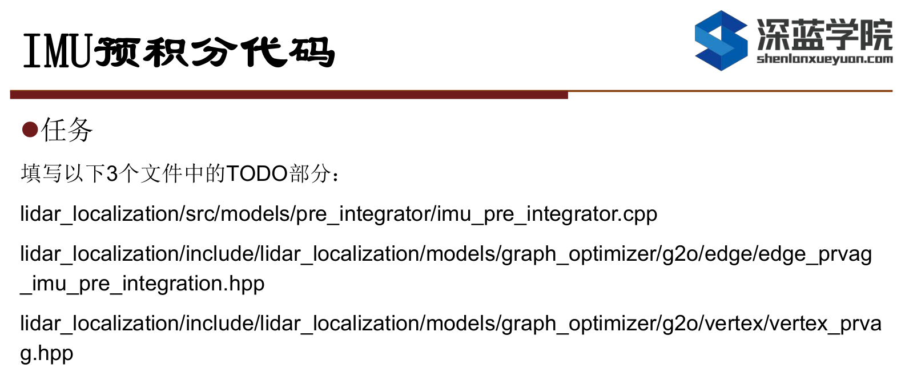

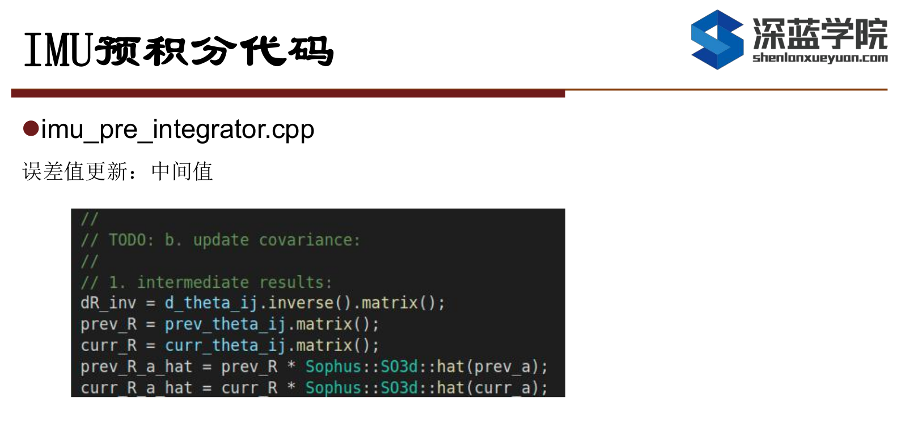

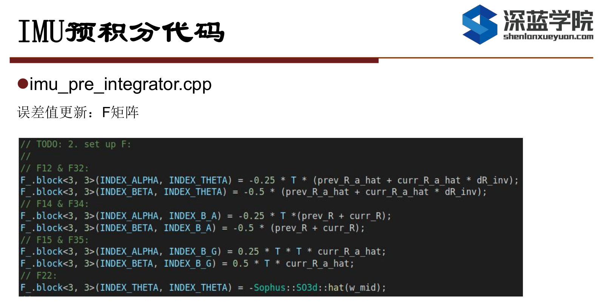

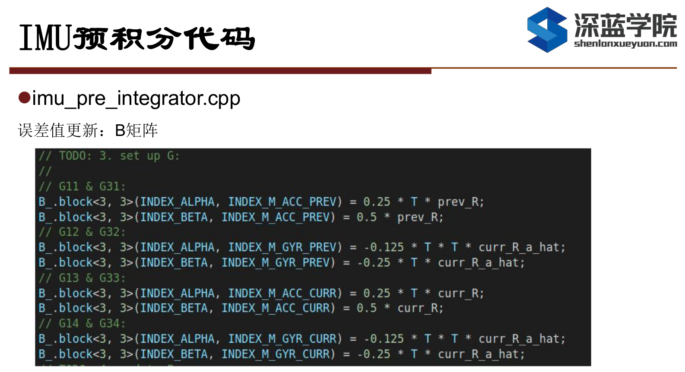

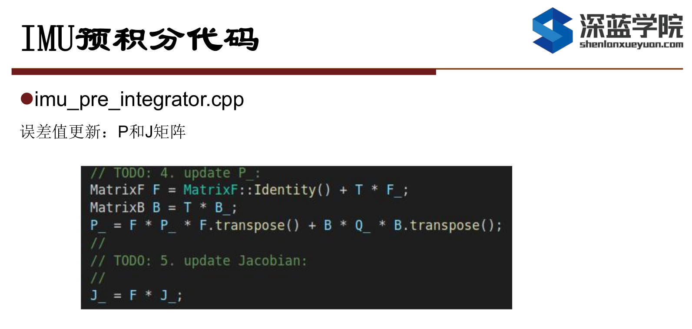

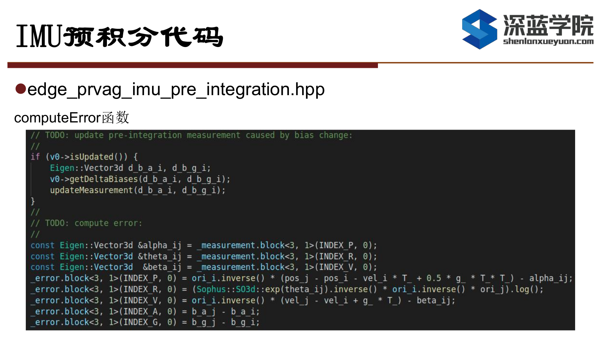

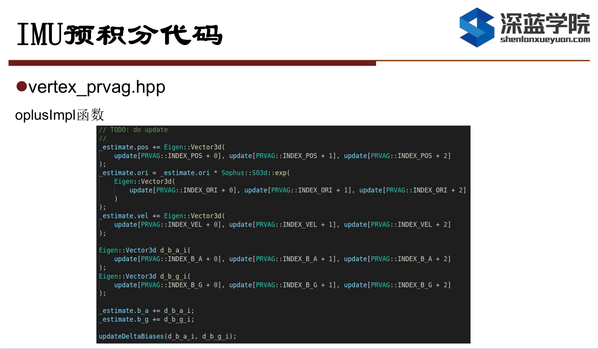

### 良好要求: 在及格基础上, 实现和不加IMU时的效果对比和分析

略

### 优秀要求: 在良好的基础上，完成融合编码器时预积分公式的推导(方差递推、残差对状态量雅可比、bias更新等)

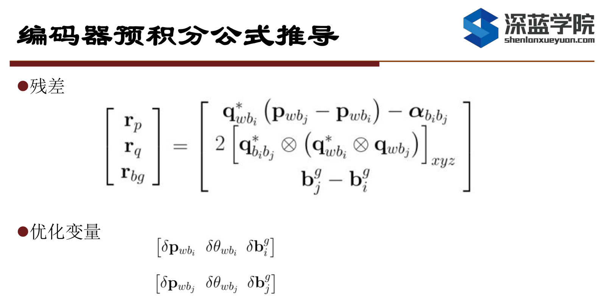

点击[此链接](doc/reference/Q3-derivation.pdf), 获取张松鹏助教的详细推导