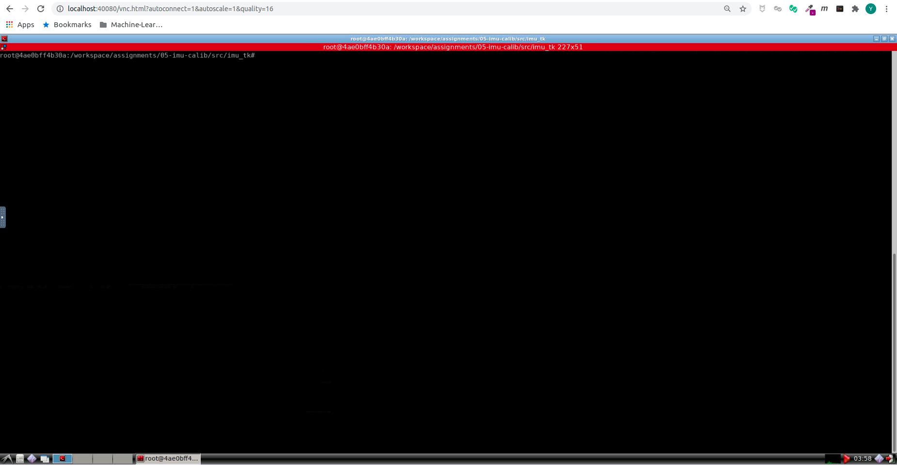
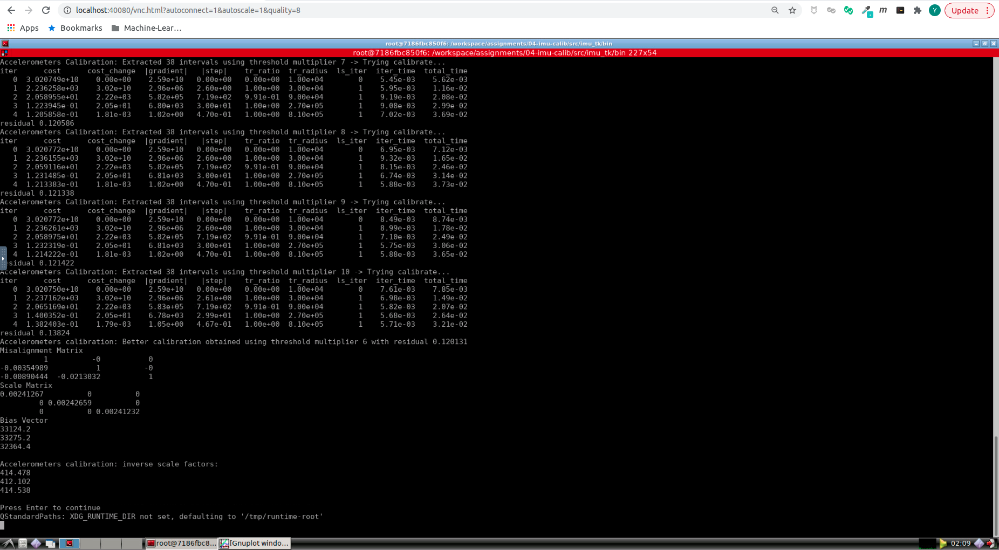
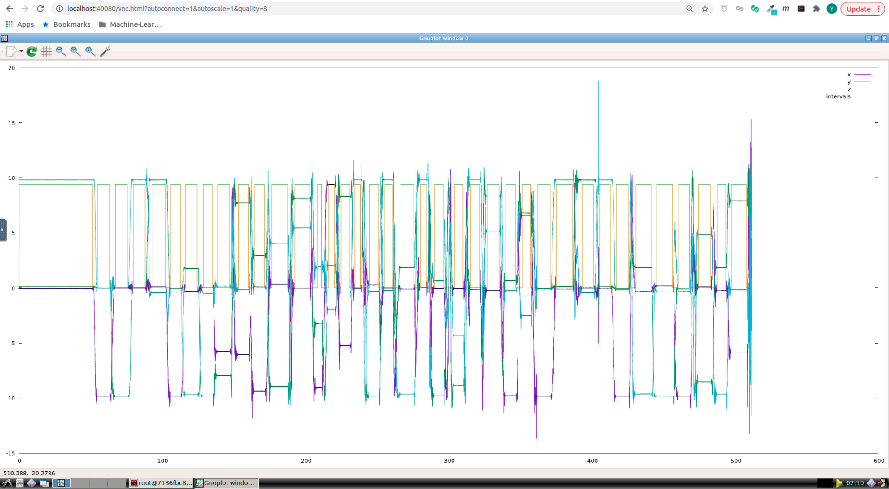

# Sensor Fusion: Lidar Odometry -- 多传感器融合定位与建图: 惯性导航原理

深蓝学院, 多传感器融合定位与建图, 第5章IMU Calib代码框架.

---

## Overview

本作业旨在加深对不依赖转台的标定方法的理解.

---

## Getting Started

### 及格要求: 完成雅克比推导, 且结果正确

推就完了! Good Luck!

### 良好要求: 完成新的内参模型下的标定, 且结果正确

启动Docker后, 打开浏览器, 进入Web Workspace. 启动Terminator, 将Shell的工作目录切换如下:



**注意** Docker环境已包含**IMU TK**的全部依赖, 可直接编译+测试内参模型以及相应的标定结果. 

使用**本地环境**的同学:

* 请参考[here](src/imu_tk/README.md), 自行完成环境配置

在**上侧**的Shell中, 输入如下命令, **编译imu_tk**

```bash
# create & go to build:
mkdir build && cd build
cmake .. && make -j4
# go back to project root:
cd ..
```

然后进入**bin**目录下, **运行IMU TK, 获得标定结果**

```bash
# go to bin
cd bin
./test_imu_calib test_data/xsens_acc.mat test_data/xsens_gyro.mat
```

成功后, 可以看到如下的Shell Output & GNU Plot Visualization. 下图演示结果已将模型修改为下三角. 

下面请搜索**TODO**, 将内参模型修改为下三角. **提交时需要明确指出对代码进行了怎样的修改. 仅复制粘贴下述示意图, 你将不会得到此题的分数**.





### 优秀要求: 使用解析式求导完成标定, 且结果正确

LOAM解析求导都搞定了, 这个对你完全不是事儿, 加油!
