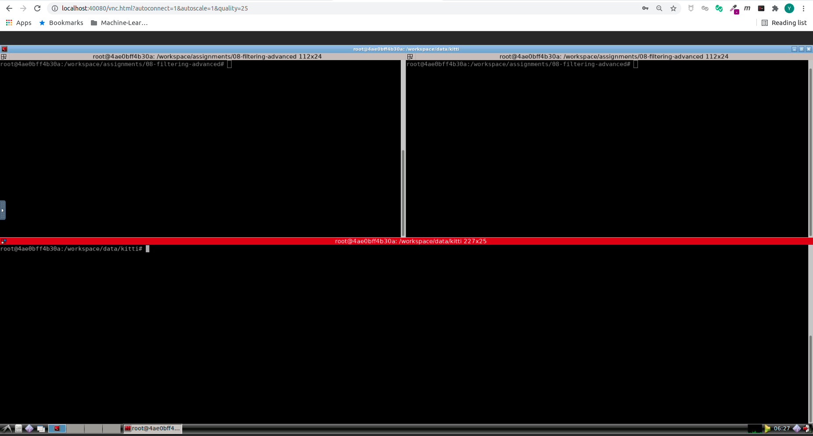
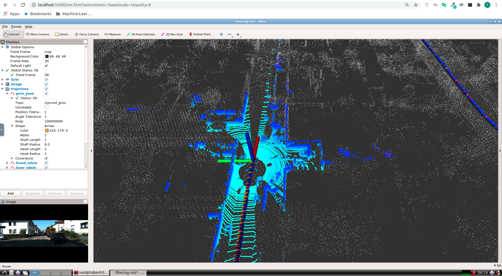
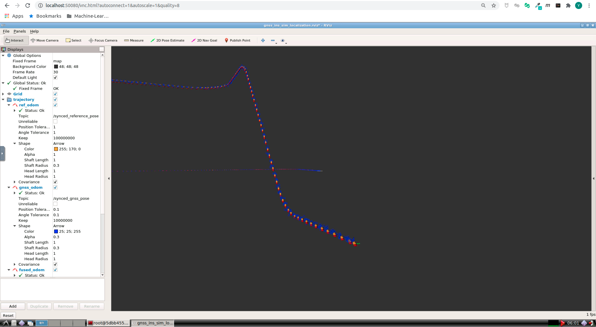

# Multi-Sensor Fusion for Localization & Mapping: Filtering Advanced -- 多传感器融合定位与建图: 基于滤波的融合方法II

深蓝学院, 多传感器融合定位与建图, 第8章Filtering Advanced代码框架.

---

## Overview

本作业旨在加深对**基于滤波的融合方法**的理解.

本章作业要求如下: 在上一讲作业里实现的滤波方案的基础上

1. 实现**融合运动模型**的滤波方法
2. 对比加入运动模型约束前后,滤波精度的变化. 由于运动模型约束更多的是改善速度的波动,而且是y向和z向的波动,因此要求展示结果时,提供b系y向和z向速度误差的曲线与指标.

注:同样由于kitti数据集质量的问题,效果的改善不一定在所有路段都能体现,可以挑选效果好的路段重点展示。

---

## Getting Started

### 及格要求: 实现新模型,且功能正常

启动Docker后, 打开浏览器, 进入Web Workspace. 启动Terminator, 将Shell的工作目录切换如下:



在**上侧**的Shell中, 输入如下命令, **编译lidar_localization**. 如遇到错误, 且非首次编译, 请尝试执行**catkin clean**, 清理catkin cache.

```bash
# build:
catkin config --install && catkin build lidar_localization
# set up session:
source install/setup.bash
# launch:
roslaunch lidar_localization kitti_localization.launch
```

在**下侧**的Shell中, 输入如下命令, **Play KITTI ROS Bag**. 如果机器的配置较低, 可以降低播放速率.

**注意**: 两个数据集均可用于完成课程, 对代码功能的运行没有任何影响, 区别在于第一个有Camera信息

```bash
# play ROS bag, full KITTI:
rosbag play kitti_2011_10_03_drive_0027_synced.bag
# play ROS bag, lidar-only KITTI:
rosbag play kitti_lidar_only_2011_10_03_drive_0027_synced.bag
```

成功后, 可以看到如下的RViz Visualization. 其中:

* **黄色**轨迹为**GNSS Localization**, 此处用作**Ground Truth**

* **蓝色**轨迹为**ESKF Fused Estimation**



此Demo为参考答案的演示效果. **请在上一章代码的基础上, 尝试理解框架, 在其中增加函数, 完成新模型的实现**. 你的任务是自行实现精度尽可能高的解算方法. 期待你的精彩发挥!

请搜索TODO, 开始你的编码 :P. 

此处将完成作业相关的配置汇总如下:

* **Hyper Params** [here](src/lidar_localization/config/filtering/kitti_filtering.yaml#L109)
  
    * 地图以及Scan Context Data输入路径
    
    * ESKF / IEKF参数配置

* **ESKF Interface** [here](src/lidar_localization/include/lidar_localization/models/kalman_filter/error_state_kalman_filter.hpp)

    * ESKF接口定义

* **ESKF Implementation** [here](src/lidar_localization/src/models/kalman_filter/error_state_kalman_filter.cpp)

    * ESKF实现

### 良好要求: 实现新模型,且部分路段性能有改善

相比及格要求, 变化不大, 编码完成后, 保存结果, 进行**evo**评估即可.

为了获取可用于**evo评估**的轨迹输出, 可通过如下`ROS Service Call`, 比较融合前后的Odometry: 

```bash
# set up session:
source install/setup.bash
# save odometry:
rosservice call /save_odometry "{}"
# run evo evaluation:
# a. laser:
evo_ape kitti ground_truth.txt laser.txt -r full --plot --plot_mode xy
# b. fused:
evo_ape kitti ground_truth.txt fused.txt -r full --plot --plot_mode xy
```

### 优秀要求: 在良好的基础上,增加编码器融合的内容,具体如下: 使用GNSS-Sim的仿真数据,实现以gps位置和编码器速度为观测量的融合方法,并分析其精度

首先使用`ROS GNSS-INS-Sim Wrapper`[here](src/gnss_ins_sim/README.md) 产生所需的仿真数据. 

此处将完成作业相关的配置汇总如下. 此处设置GNSS-INS-Sim的仿真频率为`400Hz`.

* **Hyper Params** [here](src/gnss_ins_sim/config/recorder_virtual_proving_ground.yaml#L2)
  
    * **motion_file** GNSS-INS-Sim Motion File定义
    
    * **output_name** 产生的rosbag输出路径. 默认值为 /workspace/data/gnss_ins_sim/virtual_proving_ground.bag

启动Docker后, 打开浏览器, 进入Web Workspace. 启动Terminator, 将Shell的工作目录切换如下:


在**上侧**的Shell中, 输入如下命令, **编译gnss_ins_sim**. 如遇到错误, 且非首次编译, 请尝试执行**catkin clean**, 清理catkin cache.

```bash
# build:
catkin config --install && catkin build gnss_ins_sim
# set up session:
source install/setup.bash
# launch:
roslaunch gnss_ins_sim recorder_virtual_proving_ground.launch
```

在看到提示消息**gnss_ins_sim_recorder_node-2: process has finished cleanly**后, 停止上侧Shell中ROS Nodes的运行, 至**下侧**Shell中检查产生的数据.

若一切正常, 产生的数据如下图所示:

```bash
# go to output path
cd /workspace/data/gnss_ins_sim
# show bag info:
rosbag info virtual_proving_ground.bag

path:        virtual_proving_ground.bag
version:     2.0
duration:    2:35s (155s)
start:       Mar 14 2021 05:50:03.46 (1615701003.46)
end:         Mar 14 2021 05:52:39.45 (1615701159.45)
size:        105.4 MB
messages:    374401
compression: none [135/135 chunks]
types:       geometry_msgs/TwistStamped [98d34b0043a2093cf9d9345ab6eef12e]
             nav_msgs/Odometry          [cd5e73d190d741a2f92e81eda573aca7]
             sensor_msgs/Imu            [6a62c6daae103f4ff57a132d6f95cec2]
             sensor_msgs/MagneticField  [2f3b0b43eed0c9501de0fa3ff89a45aa]
             sensor_msgs/NavSatFix      [2d3a8cd499b9b4a0249fb98fd05cfa48]
topics:      /init_pose                1 msg     : nav_msgs/Odometry         
             /reference_pose       62400 msgs    : nav_msgs/Odometry         
             /sim/sensor/gps/fix   62400 msgs    : sensor_msgs/NavSatFix     
             /sim/sensor/gps/vel   62400 msgs    : geometry_msgs/TwistStamped
             /sim/sensor/imu       62400 msgs    : sensor_msgs/Imu           
             /sim/sensor/imu/mag   62400 msgs    : sensor_msgs/MagneticField 
             /sim/sensor/odo       62400 msgs    : geometry_msgs/TwistStamped

```

随后, 即可使用**lidar_localization**, 在**GNSS-INS-Sim**上, 运行基于滤波的定位:

```bash
# launch, in upper shell:
roslaunch lidar_localization gnss_ins_sim_localization.launch
# play rosbag, in lower shell:
rosbag play virtual_proving_ground.bag
```

成功后, 可以看到如下的RViz Visualization. **此Demo为参考答案的演示效果**. 其中:

* **黄色**轨迹为真值, 此处用作Ground Truth

* **蓝色**轨迹为GNSS Position的原始测量值

* **红色**轨迹为融合后的估计值

