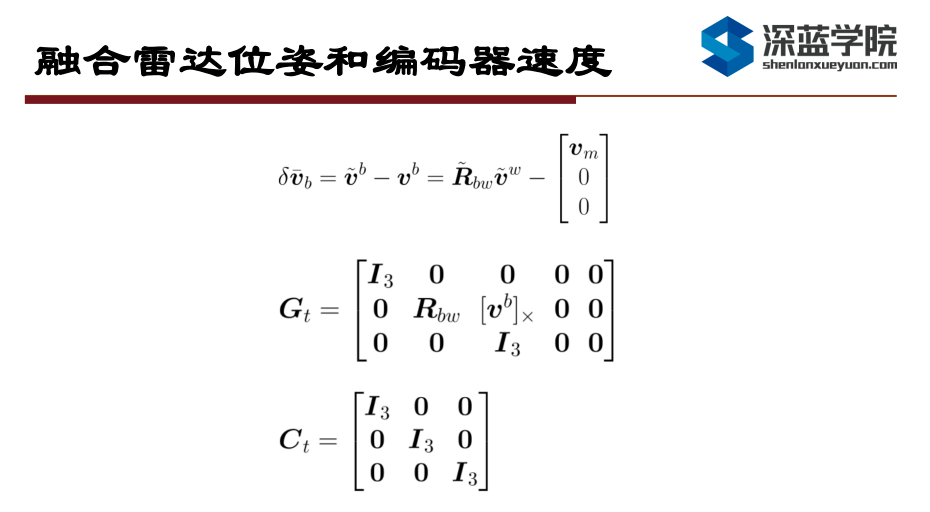
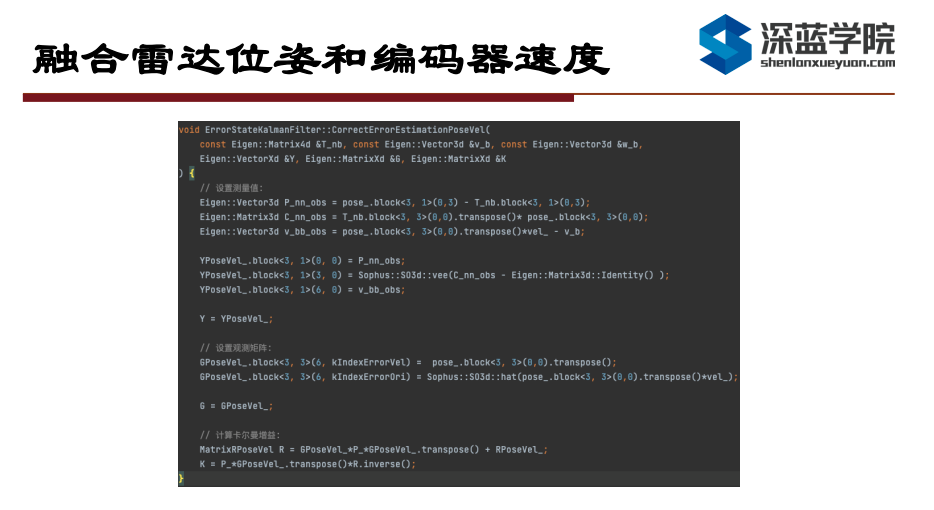
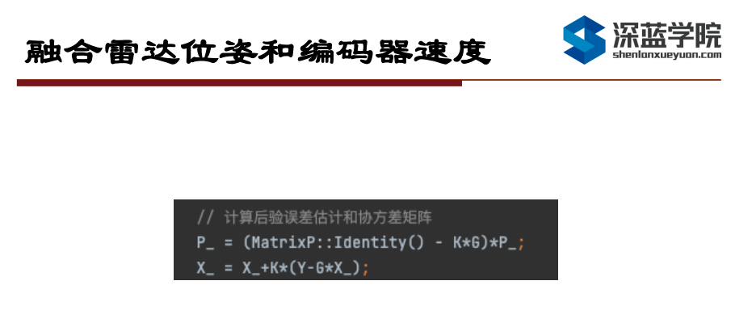
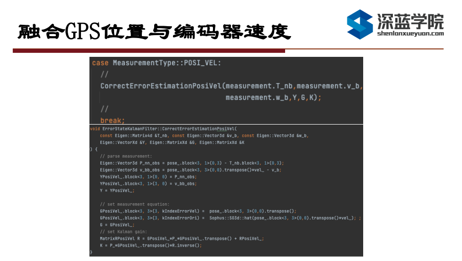

# Multi-Sensor Fusion for Localization & Mapping -- 多传感器融合定位与建图: Filtering Advanced

深蓝学院多传感器融合定位与建图第8节Filtering Advanced作业提示.

---

## Overview

本提示旨在引导您:

* 正确补全相关代码

---

## Introduction

各位同学好, 今天为大家带来第8节作业的思路分享.

---

## Motion Constraint

作业的第一部分为融合雷达位姿与编码器速度. 其核心思想是将雷达与地图进行匹配得到的位姿和编码器速度当作测量量, 与imu积分得到的先验位姿进行融合. 运动模型约束可以看作是编码器速度的一种特例, 只需要去掉x轴的速度分量就可以转换成运动模型约束, 所以这里只展示融合编码器速度的实现. 其对应的理论推导如下图所示:

相比于上一章的作业主要需要进行改动的就是CorrectErrorEstimation这个函数, 我们需要在其中增加针对编码器速度拓展的新的接口, 接口的定义如下图所示:

在新增加的接口函数中, 我们需要做的就是根据前面所述的公式, 完成卡尔曼增益K, 测量值Y, 观测矩阵G的计算, 具体的实现如下图所示. 这里由于C矩阵是一个单位阵, 在计算卡尔曼增益的时候就没有乘进去:

在计算完卡尔曼增益K, 观测矩阵G, 测量值Y之后, 我们就可以根据卡尔曼的更新公式, 完成对误差值的后验估计的计算. 之后就会执行与上一章一样的, 使用误差值对于状态值进行更新并发布. 这个流程展示了对于卡尔曼滤波框架来说, 如何将新增加的观测值融合到系统中, 从而提高系统的精度. 相比于基于优化的融合框架来说, 基于滤波的融合对于新增传感器的处理更为简单, 并不需要对数据做额外的处理, 只要传感器测量值和状态量之间可以建立起直接的观测关系, 就可以进行融合.

---

## GPS & Wheel Encoder Fusion

接下来是第二部分, 融合GPS位置和编码器速度. 相比于上一个作业, 这里的观测量缺少了姿态, 所以需要对观测方程进行调整. 主要是对G方程去掉最后一行, 对C方程只保留左上角与位置和速度有关的项. 具体实现时, 其他的部分与前面所述相同，两个关键函数如下图所示:

最后这里在运行的时候需要提醒一下大家, 左边的两张图是gnss-ins-sim生成测量数据时候的误差等级, 课程中默认使用的都是中等精度, 也就是说gps位置的协方差应该在2.5e-1左右, 而编码器应该在2.5e-3左右, 而右边是我们的作业使用的默认配置文件中的误差等级. 可以看出gps的实际误差与我们给的先验值的差距比较巨大, 这就是为什么有些同学在程序正确的情况下rviz中显示的姿态抖动非常厉害的原因. 建议大家在左边这两个值的基础上进行调参.

---

## Wrap-Up

好了，第8节作业思路分享到此结束，祝大家学习愉快, 成功全优结业, 收获理想的Offer!
