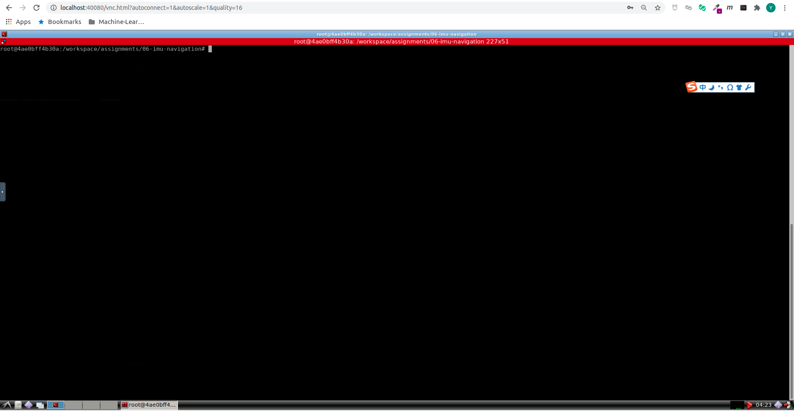
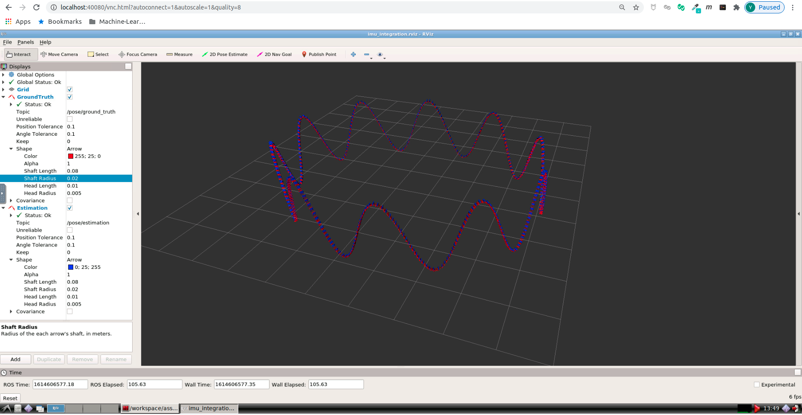

# Sensor Fusion: Lidar Odometry -- 多传感器融合定位与建图: 惯性导航解算

深蓝学院, 多传感器融合定位与建图, 第6章IMU Navigation代码框架.

---

## Overview

本作业旨在加深对**惯性导航解算**的理解.

---

## Getting Started

### 及格要求: 根据课程给定的数据, 完成基于中值法的解算

本章参考框架, 基于VIO课程作业修改得到. 该实现相比优秀要求的GNSS-Ins-Sim, 对运动的自定义程度更高. 

在此再次对贺博&高博的优秀课程表示感谢! 

启动Docker后, 打开浏览器, 进入Web Workspace. 启动Terminator, 将Shell的工作目录切换如下:



在**上侧**的Shell中, 输入如下命令, **编译imu_integration**. 如非首次编译, 且遇到错误, 请尝试执行**catkin clean**

```bash
# build:
catkin config --install && catkin build imu_integration
# set up session:
source install/setup.bash
# launch:
roslaunch imu_integration imu_integration.launch
```

成功后, 可以看到如下的RViz Visualization. 其中:

* **红色**轨迹为**Ground Truth**

* **蓝色**轨迹为**IMU Navigation Estimation**



此Demo基于已有的解算方法得到. **在你自行实现解算方法之前, 你将不会看到蓝色轨迹**. 你的任务是自行实现精度尽可能高的解算方法. 期待你的精彩发挥!

请搜索TODO, 开始你的编码 :P

### 良好要求: 根据课程给定的数据, 完成基于中值法, 欧拉法的解算, 并对精度做对比分析

相比及格要求, 变化不大, 改算法就行, Good Luck!

### 优秀要求: 利用IMU仿真程序,自己生成不同运动状况(静止、匀速、加减速、快速转弯等)的仿真数据,对比两种解算方法精度差异与运动状况的关系,并给出原因分析

注意: 为了提升课程的区分度, 从本章开始, **优秀要求的难度会大幅提升, 框架的提示会越来越少**, 期待喜爱挑战的你的精彩发挥!

此处推荐使用**GNSS-Ins-Sim**生成仿真数据, 也可以沿用基础框架的方法生成, 但为了胡后续学习考虑, 推荐**尽早开始熟悉GNSS-Ins-Sim的使用**.

为了方便你的学习， 此处已额外提供`gnss-ins-sim ROS wrapper package`. 使用它, 仅需更改配置文件, 即可得到ROS Bag格式的GNSS-Ins-Sim仿真数据. 

此处以生成**Allan Variance Estimation**测试数据为例. 

首先修改**config**[here](src/gnss_ins_sim/config/recorder_allan_variance_analysis.yaml), 指定输出路径. 此处以Docker环境为例. **输出前请务必保证output_path已存在**:

```yaml
# motion def:
motion_file: allan_variance_analysis.csv
# IMU params:
imu: 1
# sample frequency of simulated GNSS/IMU data:
sample_frequency:
    imu: 100.0
    gps: 10.0
# topic name:
topic_name: /sim/sensor/imu
# output rosbag path:
output_path: /workspace/data/gnss_ins_sim/allan_variance_analysis
# output name:
output_name: data.bag
```

接着, 修改**GNSS-Ins-Sim**的**motion_def**文件[here](src/gnss_ins_sim/config/motion_def/allan_variance_analysis.csv):

```csv
ini lat (deg),ini lon (deg),ini alt (m),ini vx_body (m/s),ini vy_body (m/s),ini vz_body (m/s),ini yaw (deg),ini pitch (deg),ini roll (deg)
31.224361,121.469170,0,0,0,0,0,0,0
command type,yaw (deg),pitch (deg),roll (deg),vx_body (m/s),vy_body (m/s),vz_body (m/s),command duration (s),GPS visibility
1,0,0,0,0,0,0,3600,1
```

最后, 编译&运行.

```bash
# build
catkin config --install && catkin build gnss_ins_sim
# set up session:
source install/setup.bash
# generate data:
roslaunch gnss_ins_sim gnss_ins_sim_recorder.launch
```

若使用默认配置, 可在Docker环境`/workspace/data/gnss_ins_sim/allan_variance_analysis`路径下发现生成的`ROS Bag`:

```bash
root@7186fbc850f6:/workspace/data/gnss_ins_sim/allan_variance_analysis# rosbag info data.bag 
path:        data.bag
version:     2.0
duration:    59:59s (3599s)
start:       Mar 01 2021 14:27:42.03 (1614608862.03)
end:         Mar 01 2021 15:27:42.02 (1614612462.02)
size:        128.1 MB
messages:    360000
compression: none [166/166 chunks]
types:       sensor_msgs/Imu [6a62c6daae103f4ff57a132d6f95cec2]
topics:      /sim/sensor/imu   360000 msgs    : sensor_msgs/Imu
```

好, 提示就这么多了, 请志在优秀的你, 开始你的表演!